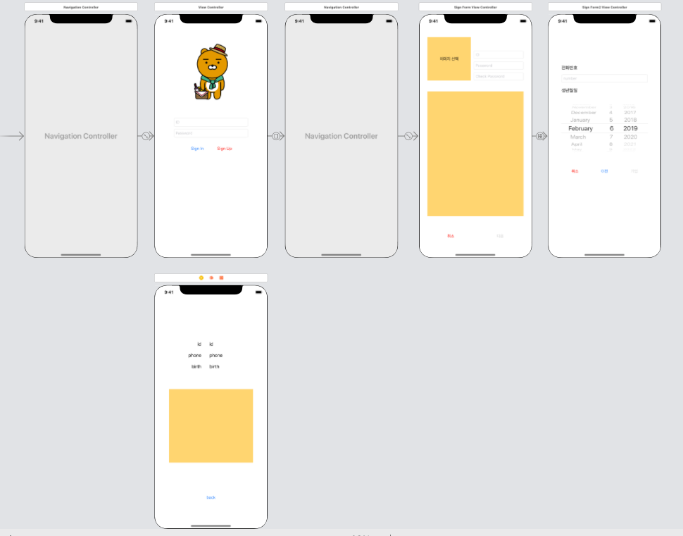
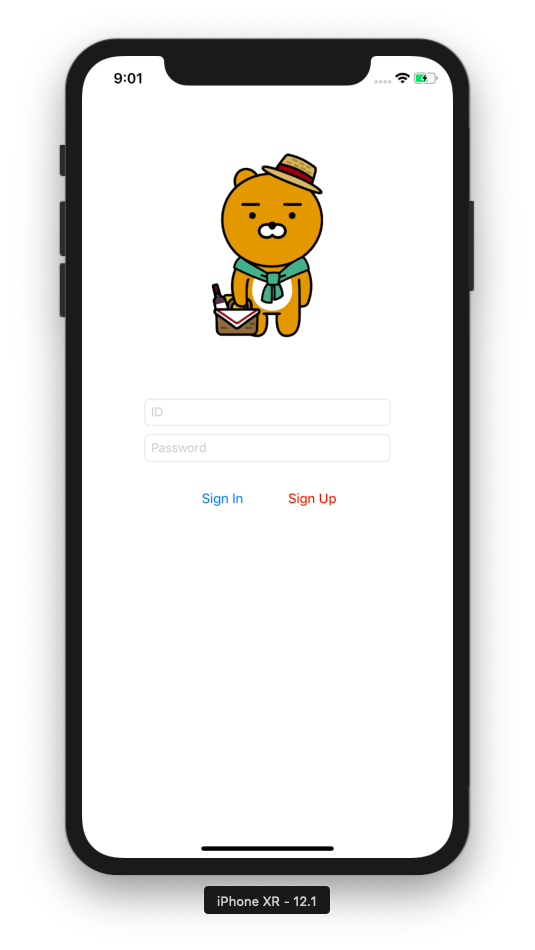
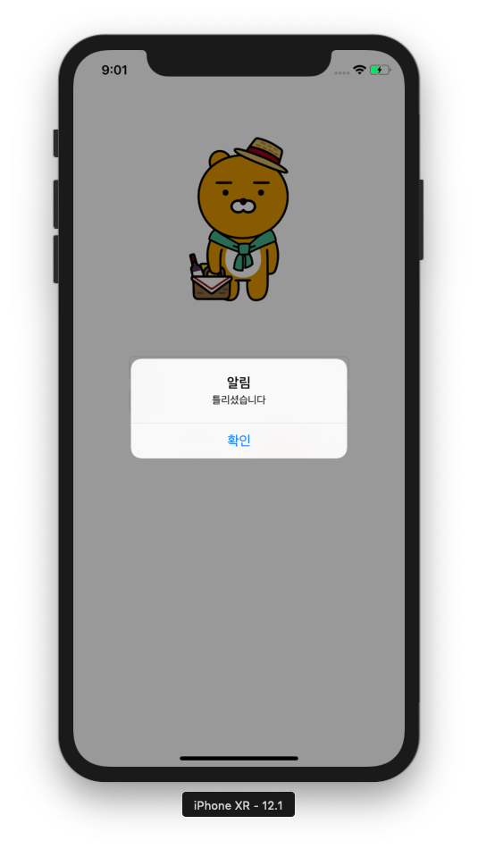
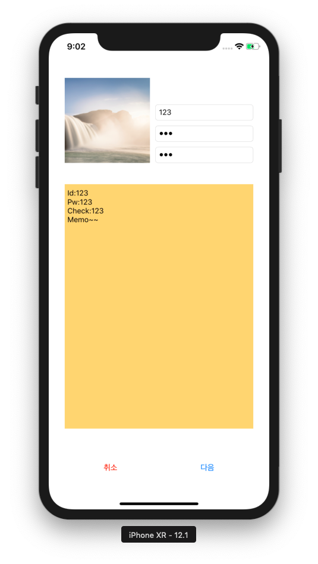
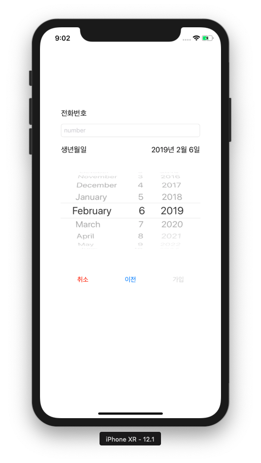
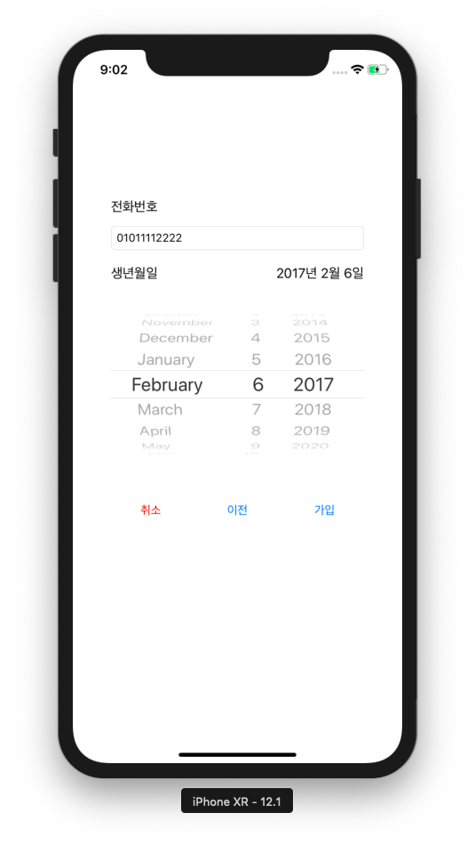
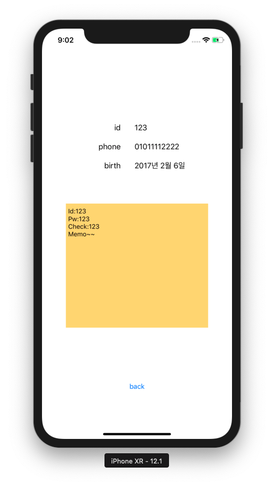

# SignUp Form
- View
    - 메인 - [ViewController](##ViewController)
    - form1 - [SignFormViewController](##SignFormViewController)
    - form2 - [SignForm2ViewController](##SignForm2ViewController)
    - login - [LoginViewController](##LoginViewController)
- 주요기능
    - ImagePicker
    - DatePicker
    - Alert
    - Navigation
    - Present 
    - Instance(Singleton)
     
---
## <b>세부기능</b>

## ViewController

- 회원가입 버튼 클릭시 form1로 전환 - modal present
- instance객체가 생성되어 있을시 id와 pw비교하여 객체에 저장된값과 일치하면 login화면으로 전환 - navigation push
---
## SignFormViewController
 

- UIImagePicker를 사용하여 이미지 선택
    - allowsEditing = true // 편집모드 사용
    - sourceType = .photoLibrary //앨범 

- pw와 checkpw가 일치하면 다음버튼 활성화 아닐시 비
활성화 
- 화면터치시, 키보드 리턴버튼 클릭시 키보드내려감
- 다음버튼 클릭시 form2로 전환 - navigation push
- 취소버튼 클릭시 메인화면으로 전환 - modal dismiss
---
## SignForm2ViewController
 
 

- UIDatePicker를 사용하여 날짜 선택
    - DateFormatter이용
        - dataStyle = .long
        - timeStyle = .none
        - locale = Locale(identifier: "ko_KR")  //한글
    - 날짜를 선택해야 가입버튼 활성화
- 화면터치시 키보드내려감
- 취소버튼 클릭시 메인화면으로 이동 - modal dismiss
- 이전버튼 클릭시 전단계로 이동 - navigation pop
- 가입버튼 클릭시 값을 저장하고 메인화면으로 이동 - modal dismiss

## LoginViewController
 

- instance의 값을 받아서 출력